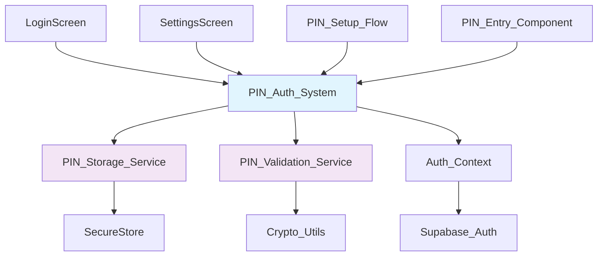
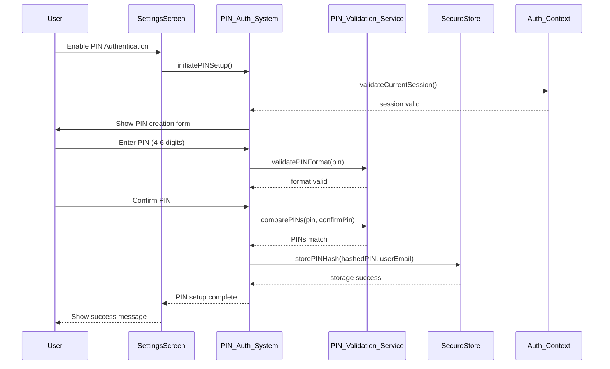
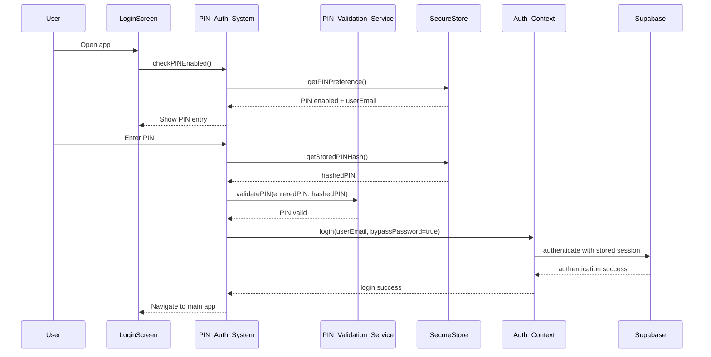

# Design Document: PIN Password Authentication

## Overview

This feature adds PIN password authentication to the Internly mobile app, allowing users to create and use a simple 4-6 digit PIN for quick authentication instead of typing their full password. The feature integrates with the existing Supabase authentication system and provides a secure, convenient login experience that's faster than password entry while maintaining security through device-level encryption. The design focuses on simplicity ("madali lang gumawa") with an intuitive setup flow and seamless integration with existing authentication patterns.

## Architecture



## Sequence Diagrams

### PIN Setup Flow



### PIN Login Flow



## Components and Interfaces

### Component 1: PIN_Auth_System

**Purpose**: Central coordinator for all PIN authentication operations

**Interface**:
```typescript
interface PINAuthSystem {
  // Setup operations
  initiatePINSetup(): Promise<void>
  createPIN(pin: string, confirmPin: string): Promise<PINSetupResult>
  disablePIN(): Promise<void>
  
  // Authentication operations
  checkPINEnabled(): Promise<boolean>
  authenticateWithPIN(pin: string): Promise<AuthResult>
  
  // Management operations
  changePIN(currentPin: string, newPin: string): Promise<PINChangeResult>
  resetPIN(): Promise<void>
  
  // State queries
  getPINStatus(): Promise<PINStatus>
  getUserEmail(): Promise<string | null>
}

interface PINSetupResult {
  success: boolean
  error?: string
}

interface AuthResult {
  success: boolean
  user?: User
  error?: string
}

interface PINChangeResult {
  success: boolean
  error?: string
}

interface PINStatus {
  enabled: boolean
  userEmail?: string
  lastUsed?: Date
}
```

**Responsibilities**:
- Coordinate PIN setup and management flows
- Interface with secure storage and validation services
- Integrate with existing Auth_Context
- Handle error states and user feedback

### Component 2: PIN_Storage_Service

**Purpose**: Secure storage and retrieval of PIN-related data

**Interface**:
```typescript
interface PINStorageService {
  storePINData(data: PINStorageData): Promise<void>
  getPINData(): Promise<PINStorageData | null>
  clearPINData(): Promise<void>
  updateLastUsed(): Promise<void>
}

interface PINStorageData {
  hashedPIN: string
  userEmail: string
  salt: string
  createdAt: Date
  lastUsed?: Date
}
```

**Responsibilities**:
- Encrypt and store PIN hash with salt
- Store associated user email
- Manage PIN metadata (creation date, last used)
- Provide secure data retrieval

### Component 3: PIN_Validation_Service

**Purpose**: PIN format validation and cryptographic operations

**Interface**:
```typescript
interface PINValidationService {
  validatePINFormat(pin: string): PINFormatResult
  hashPIN(pin: string, salt: string): Promise<string>
  generateSalt(): string
  comparePINs(enteredPIN: string, storedHash: string, salt: string): Promise<boolean>
  isSecurePIN(pin: string): SecurityCheckResult
}

interface PINFormatResult {
  valid: boolean
  errors: string[]
}

interface SecurityCheckResult {
  secure: boolean
  warnings: string[]
}
```

**Responsibilities**:
- Validate PIN format (4-6 digits, no sequences)
- Generate cryptographically secure hashes
- Compare entered PIN with stored hash
- Check for weak PIN patterns

### Component 4: PIN_Entry_Component

**Purpose**: Reusable UI component for PIN input

**Interface**:
```typescript
interface PINEntryComponent {
  onPINComplete: (pin: string) => void
  onPINChange: (pin: string) => void
  maxLength: number
  placeholder: string
  error?: string
  loading?: boolean
  autoFocus?: boolean
}
```

**Responsibilities**:
- Provide intuitive PIN input interface
- Handle numeric keypad input
- Show visual feedback for PIN entry
- Display error states

## Data Models

### Model 1: PINAuthData

```typescript
interface PINAuthData {
  hashedPIN: string        // SHA-256 hash of PIN + salt
  userEmail: string        // Associated user email
  salt: string            // Cryptographic salt
  createdAt: Date         // PIN creation timestamp
  lastUsed?: Date         // Last successful authentication
  attempts: number        // Failed attempt counter
  lockedUntil?: Date      // Lockout expiration
}
```

**Validation Rules**:
- hashedPIN must be valid SHA-256 hash (64 hex characters)
- userEmail must be valid email format
- salt must be 32-character random string
- attempts must be non-negative integer ≤ 5

### Model 2: PINPreferences

```typescript
interface PINPreferences {
  enabled: boolean
  userEmail: string
  requirePINOnAppStart: boolean
  lockoutDuration: number  // minutes
  maxAttempts: number
}
```

**Validation Rules**:
- enabled must be boolean
- userEmail required when enabled is true
- lockoutDuration must be positive integer (1-60 minutes)
- maxAttempts must be integer between 3-10

## Algorithmic Pseudocode

### Main PIN Setup Algorithm

```typescript
async function createPIN(pin: string, confirmPin: string): Promise<PINSetupResult> {
  // Preconditions: User is authenticated, PIN format is valid
  // Postconditions: PIN is securely stored or error is returned
  
  try {
    // Step 1: Validate input format
    const formatResult = validatePINFormat(pin)
    if (!formatResult.valid) {
      return { success: false, error: formatResult.errors.join(', ') }
    }
    
    // Step 2: Check PIN confirmation
    if (pin !== confirmPin) {
      return { success: false, error: 'PINs do not match' }
    }
    
    // Step 3: Security validation
    const securityResult = isSecurePIN(pin)
    if (!securityResult.secure) {
      return { success: false, error: 'PIN is not secure: ' + securityResult.warnings.join(', ') }
    }
    
    // Step 4: Generate salt and hash
    const salt = generateSalt()
    const hashedPIN = await hashPIN(pin, salt)
    
    // Step 5: Get current user email
    const userEmail = await getCurrentUserEmail()
    if (!userEmail) {
      return { success: false, error: 'User not authenticated' }
    }
    
    // Step 6: Store PIN data securely
    const pinData: PINAuthData = {
      hashedPIN,
      userEmail,
      salt,
      createdAt: new Date(),
      attempts: 0
    }
    
    await storePINData(pinData)
    
    // Step 7: Update preferences
    await updatePINPreferences({
      enabled: true,
      userEmail,
      requirePINOnAppStart: true,
      lockoutDuration: 5,
      maxAttempts: 5
    })
    
    return { success: true }
    
  } catch (error) {
    return { success: false, error: error.message }
  }
}
```

**Preconditions**:
- User has valid authentication session
- PIN and confirmPin are provided strings
- Device has secure storage capability

**Postconditions**:
- PIN is securely hashed and stored with salt
- User preferences are updated to enable PIN auth
- Returns success result or descriptive error

**Loop Invariants**: N/A (no loops in this algorithm)

### PIN Authentication Algorithm

```typescript
async function authenticateWithPIN(enteredPIN: string): Promise<AuthResult> {
  // Preconditions: PIN is enabled, enteredPIN is valid format
  // Postconditions: User is authenticated or attempt is recorded
  
  try {
    // Step 1: Check if PIN authentication is enabled
    const pinData = await getPINData()
    if (!pinData) {
      return { success: false, error: 'PIN authentication not enabled' }
    }
    
    // Step 2: Check lockout status
    if (pinData.lockedUntil && pinData.lockedUntil > new Date()) {
      const remainingTime = Math.ceil((pinData.lockedUntil.getTime() - Date.now()) / 60000)
      return { success: false, error: `Account locked. Try again in ${remainingTime} minutes.` }
    }
    
    // Step 3: Validate entered PIN format
    const formatResult = validatePINFormat(enteredPIN)
    if (!formatResult.valid) {
      return { success: false, error: 'Invalid PIN format' }
    }
    
    // Step 4: Compare with stored hash
    const isValid = await comparePINs(enteredPIN, pinData.hashedPIN, pinData.salt)
    
    if (isValid) {
      // Step 5a: Successful authentication
      await updateLastUsed()
      await resetFailedAttempts()
      
      // Step 6a: Authenticate with Auth_Context
      const user = await authenticateUser(pinData.userEmail)
      return { success: true, user }
      
    } else {
      // Step 5b: Failed authentication
      const newAttempts = pinData.attempts + 1
      await incrementFailedAttempts(newAttempts)
      
      // Step 6b: Check if lockout needed
      const maxAttempts = await getMaxAttempts()
      if (newAttempts >= maxAttempts) {
        const lockoutDuration = await getLockoutDuration()
        const lockedUntil = new Date(Date.now() + lockoutDuration * 60000)
        await setLockoutTime(lockedUntil)
        return { success: false, error: `Too many failed attempts. Account locked for ${lockoutDuration} minutes.` }
      }
      
      const remainingAttempts = maxAttempts - newAttempts
      return { success: false, error: `Incorrect PIN. ${remainingAttempts} attempts remaining.` }
    }
    
  } catch (error) {
    return { success: false, error: 'Authentication failed: ' + error.message }
  }
}
```

**Preconditions**:
- PIN authentication is enabled for current user
- enteredPIN is a non-empty string
- Secure storage is accessible

**Postconditions**:
- User is authenticated on success, or attempt counter is incremented
- Lockout is applied after max failed attempts
- Last used timestamp is updated on success

**Loop Invariants**: N/A (no loops in this algorithm)

### PIN Validation Algorithm

```typescript
function validatePINFormat(pin: string): PINFormatResult {
  // Preconditions: pin is a string
  // Postconditions: returns validation result with specific error messages
  
  const errors: string[] = []
  
  // Check length
  if (pin.length < 4 || pin.length > 6) {
    errors.push('PIN must be 4-6 digits long')
  }
  
  // Check if all characters are digits
  if (!/^\d+$/.test(pin)) {
    errors.push('PIN must contain only numbers')
  }
  
  // Check for weak patterns (if all digits)
  if (/^\d+$/.test(pin)) {
    // Check for repeated digits (1111, 2222, etc.)
    if (/^(\d)\1+$/.test(pin)) {
      errors.push('PIN cannot be all the same digit')
    }
    
    // Check for sequential patterns (1234, 4321, etc.)
    const isSequential = isSequentialPattern(pin)
    if (isSequential) {
      errors.push('PIN cannot be a sequential pattern')
    }
  }
  
  return {
    valid: errors.length === 0,
    errors
  }
}

function isSequentialPattern(pin: string): boolean {
  // Check ascending sequence (1234, 2345, etc.)
  let isAscending = true
  for (let i = 1; i < pin.length; i++) {
    if (parseInt(pin[i]) !== parseInt(pin[i-1]) + 1) {
      isAscending = false
      break
    }
  }
  
  // Check descending sequence (4321, 5432, etc.)
  let isDescending = true
  for (let i = 1; i < pin.length; i++) {
    if (parseInt(pin[i]) !== parseInt(pin[i-1]) - 1) {
      isDescending = false
      break
    }
  }
  
  return isAscending || isDescending
}
```

**Preconditions**:
- pin parameter is a string (may be empty or invalid)

**Postconditions**:
- Returns PINFormatResult with valid boolean and error array
- Errors array contains specific validation failure messages
- No side effects on input parameter

**Loop Invariants**:
- For sequential check loops: all previously checked digit pairs maintain sequence relationship

## Key Functions with Formal Specifications

### Function 1: hashPIN()

```typescript
async function hashPIN(pin: string, salt: string): Promise<string>
```

**Preconditions:**
- `pin` is non-empty string of 4-6 digits
- `salt` is 32-character random string
- Crypto API is available

**Postconditions:**
- Returns SHA-256 hash as 64-character hex string
- Same pin + salt always produces same hash
- Different pins or salts produce different hashes

**Loop Invariants:** N/A (no loops)

### Function 2: storePINData()

```typescript
async function storePINData(data: PINAuthData): Promise<void>
```

**Preconditions:**
- `data` is valid PINAuthData object
- `data.hashedPIN` is valid SHA-256 hash
- `data.userEmail` is valid email format
- SecureStore is available

**Postconditions:**
- Data is encrypted and stored in device secure storage
- Previous PIN data (if any) is overwritten
- Storage operation completes successfully or throws error

**Loop Invariants:** N/A (no loops)

### Function 3: comparePINs()

```typescript
async function comparePINs(enteredPIN: string, storedHash: string, salt: string): Promise<boolean>
```

**Preconditions:**
- `enteredPIN` is non-empty string
- `storedHash` is valid SHA-256 hash string
- `salt` is non-empty string

**Postconditions:**
- Returns true if and only if hash(enteredPIN + salt) equals storedHash
- No side effects on any parameters
- Comparison is cryptographically secure

**Loop Invariants:** N/A (no loops)

## Example Usage

```typescript
// Example 1: PIN Setup Flow
const pinAuthSystem = new PINAuthSystem()

// User wants to enable PIN
const setupResult = await pinAuthSystem.initiatePINSetup()
if (setupResult.success) {
  // User enters PIN
  const createResult = await pinAuthSystem.createPIN('1234', '1234')
  if (createResult.success) {
    console.log('PIN created successfully')
  } else {
    console.error('PIN creation failed:', createResult.error)
  }
}

// Example 2: PIN Authentication
const authResult = await pinAuthSystem.authenticateWithPIN('1234')
if (authResult.success) {
  console.log('User authenticated:', authResult.user)
  // Navigate to main app
} else {
  console.error('Authentication failed:', authResult.error)
  // Show error message
}

// Example 3: PIN Management
const status = await pinAuthSystem.getPINStatus()
if (status.enabled) {
  // Show PIN options in settings
  const changeResult = await pinAuthSystem.changePIN('1234', '5678')
  if (changeResult.success) {
    console.log('PIN changed successfully')
  }
}

// Example 4: Component Usage
<PINEntryComponent
  maxLength={6}
  placeholder="Enter your PIN"
  onPINComplete={(pin) => handlePINEntry(pin)}
  onPINChange={(pin) => clearError()}
  error={errorMessage}
  loading={isAuthenticating}
  autoFocus={true}
/>
```

## Correctness Properties

*A property is a characteristic or behavior that should hold true across all valid executions of a system—essentially, a formal statement about what the system should do. Properties serve as the bridge between human-readable specifications and machine-verifiable correctness guarantees.*

### Property 1: PIN Format Validation

For any input string, the PIN validation service SHALL accept it as valid if and only if it is 4-6 digits long, contains only numeric characters, and does not match weak patterns (all identical digits or sequential patterns).

**Validates: Requirements 1.2, 1.3, 1.4, 1.5**

### Property 2: PIN Confirmation Matching

For any pair of PIN inputs during setup, the PIN authentication system SHALL proceed with PIN creation if and only if both PINs match exactly.

**Validates: Requirement 1.6**

### Property 3: Cryptographic Hash Security

For any valid PIN and generated salt, the hashing function SHALL produce a SHA-256 hash that is cryptographically secure, irreversible, and deterministic (same PIN + salt always produces the same hash).

**Validates: Requirements 1.7, 5.2, 5.3**

### Property 4: Complete PIN Data Storage

For any successfully created PIN, the storage service SHALL store all required fields (hashed PIN, salt, user email, creation timestamp) as a single encrypted record in SecureStore.

**Validates: Requirements 1.8, 5.1, 5.4**

### Property 5: PIN Authentication Correctness

For any user and entered PIN, authentication SHALL succeed if and only if the hash of the entered PIN with the stored salt matches the stored PIN hash.

**Validates: Requirements 2.4, 2.5, 2.6**

### Property 6: Failed Attempt Counter Increment

For any incorrect PIN entry, the failed attempts counter SHALL increment by exactly 1.

**Validates: Requirement 3.1**

### Property 7: Lockout Trigger

For any user, when the failed attempts counter reaches or exceeds the maximum allowed attempts, the system SHALL lock the account for the specified lockout duration.

**Validates: Requirement 3.3**

### Property 8: Lockout Prevention

For any account in locked state, the system SHALL prevent all PIN authentication attempts until the lockout duration expires.

**Validates: Requirement 3.4**

### Property 9: Successful Authentication Side Effects

For any successful PIN authentication, the system SHALL: (1) update the last used timestamp, (2) reset the failed attempts counter to zero, and (3) establish a valid Auth_Context session.

**Validates: Requirements 2.7, 2.8, 2.6**

### Property 10: PIN Data Replacement

For any PIN change operation with verified current PIN, the storage service SHALL completely replace the old PIN data (hash, salt, timestamp) with the new PIN data.

**Validates: Requirement 4.5**

### Property 11: PIN Data Clearing

For any disable PIN operation, the storage service SHALL remove all PIN-related data from SecureStore and update preferences to reflect disabled state.

**Validates: Requirements 4.7, 4.8**

### Property 12: Salt Uniqueness

For any sequence of PIN creation operations, each PIN SHALL receive a unique cryptographic salt.

**Validates: Requirement 5.2**

### Property 13: No Network Transmission

For any PIN operation (creation, authentication, change, disable), no PIN data SHALL be transmitted over the network.

**Validates: Requirement 5.6**

### Property 14: No Logging of PIN Data

For any PIN operation, no PIN data (plaintext or hashed) SHALL be written to application logs.

**Validates: Requirement 5.7**

### Property 15: UI Digit Masking

For any digit entered in the PIN entry component, the digit SHALL be masked for security in the visual display.

**Validates: Requirement 6.3**

### Property 16: Auto-Validation Trigger

For any PIN entry that reaches maximum length (4-6 digits), the PIN entry component SHALL automatically trigger validation without requiring additional user action.

**Validates: Requirement 6.4**

### Property 17: Error Recovery

For any PIN validation error, the system SHALL display a specific error message and allow the user to clear and re-enter the PIN.

**Validates: Requirements 6.5, 6.6, 8.4**

### Property 18: Preference Persistence After Logout

For any user logout operation, the PIN enabled preference SHALL persist and be available for the next login session.

**Validates: Requirement 7.6**

### Property 19: SecureStore Unavailable Fallback

If SecureStore is unavailable, the system SHALL disable PIN functionality and fall back to password authentication with an informative message.

**Validates: Requirements 8.1, 8.2**

### Property 20: Configuration Bounds Enforcement

For any configuration update, the system SHALL enforce that lockout duration is between 1-60 minutes and maximum attempts is between 3-10 attempts.

**Validates: Requirements 10.4, 10.5**

## Error Handling

### Error Scenario 1: Invalid PIN Format

**Condition**: User enters PIN with non-numeric characters or wrong length
**Response**: Display specific validation error message
**Recovery**: Allow user to re-enter PIN with format guidance

### Error Scenario 2: PIN Mismatch During Setup

**Condition**: PIN and confirmation PIN don't match during creation
**Response**: Show "PINs do not match" error
**Recovery**: Clear confirmation field, allow re-entry

### Error Scenario 3: Too Many Failed Attempts

**Condition**: User exceeds maximum PIN attempts (default 5)
**Response**: Lock account for specified duration (default 5 minutes)
**Recovery**: Show countdown timer, allow password fallback

### Error Scenario 4: Secure Storage Unavailable

**Condition**: Device secure storage is not accessible
**Response**: Disable PIN feature, show informative message
**Recovery**: Fall back to password authentication only

### Error Scenario 5: Biometric Enrollment Changes

**Condition**: Device biometric data changes after PIN setup
**Response**: Maintain PIN functionality (unlike biometric auth)
**Recovery**: PIN continues to work independently

## Testing Strategy

### Unit Testing Approach

Test individual components in isolation with comprehensive coverage of edge cases, error conditions, and security validations. Focus on cryptographic functions, validation logic, and storage operations.

**Key Test Cases**:
- PIN format validation with various invalid inputs
- Hash generation consistency and uniqueness
- Storage encryption and retrieval accuracy
- Lockout mechanism timing and reset
- Error handling for all failure scenarios

**Coverage Goals**: 95% code coverage with emphasis on security-critical paths

### Property-Based Testing Approach

Use property-based testing to verify security and consistency properties across large input spaces.

**Property Test Library**: fast-check (for React Native/TypeScript)

**Key Properties to Test**:
- Hash consistency: same PIN + salt always produces same hash
- Hash uniqueness: different PINs produce different hashes
- Validation consistency: PIN format rules applied uniformly
- Authentication correctness: valid PINs authenticate, invalid ones don't
- Lockout behavior: failed attempts correctly trigger lockouts

### Integration Testing Approach

Test complete PIN authentication flows with real Auth_Context integration, secure storage operations, and UI component interactions.

**Integration Scenarios**:
- End-to-end PIN setup flow
- Complete authentication with Auth_Context
- Settings integration and preference management
- Error recovery and fallback mechanisms

## Performance Considerations

PIN authentication should complete within 500ms for optimal user experience. Hash operations use efficient SHA-256 implementation. Secure storage operations are optimized for minimal latency. UI components use React Native performance best practices with proper memoization.

## Security Considerations

PIN data is encrypted at rest using device-level secure storage (expo-secure-store). Cryptographic salts prevent rainbow table attacks. Failed attempt tracking prevents brute force attacks. PIN validation prevents weak patterns (1111, 1234, etc.). No PIN data is transmitted over network or logged. Integration with existing Supabase security model maintained.

## Dependencies

- **expo-secure-store**: Device-level encrypted storage
- **expo-crypto**: Cryptographic operations (SHA-256, random generation)
- **react-native-paper**: UI components for consistent design
- **@react-navigation/native**: Navigation integration
- **Existing Auth_Context**: Integration with current authentication system
- **Supabase**: Backend authentication service (existing)